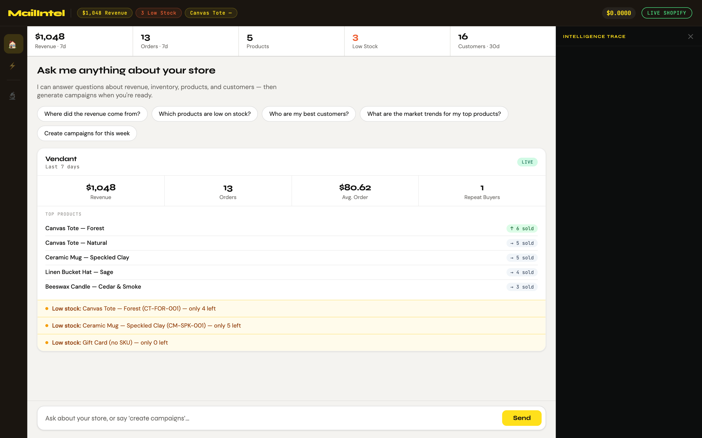
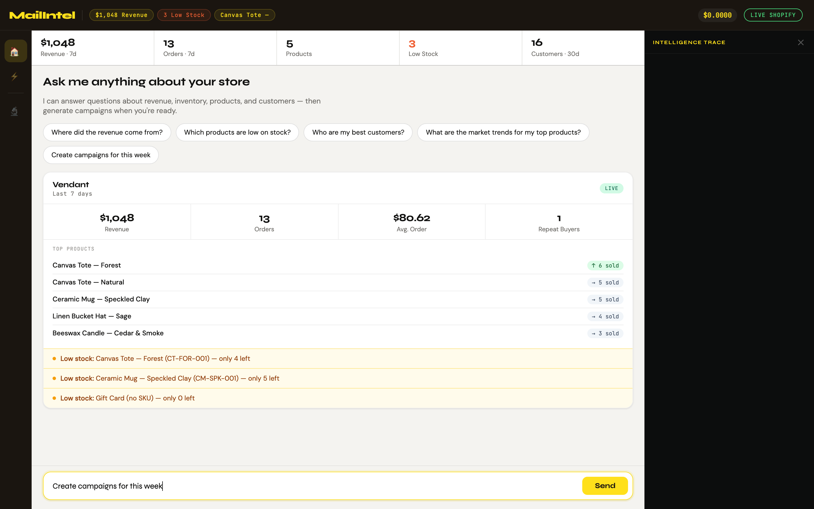
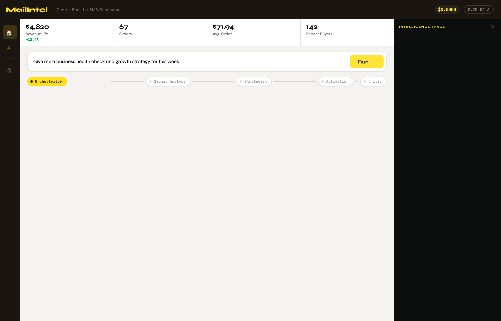
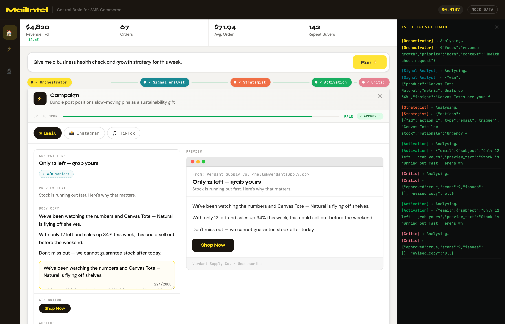
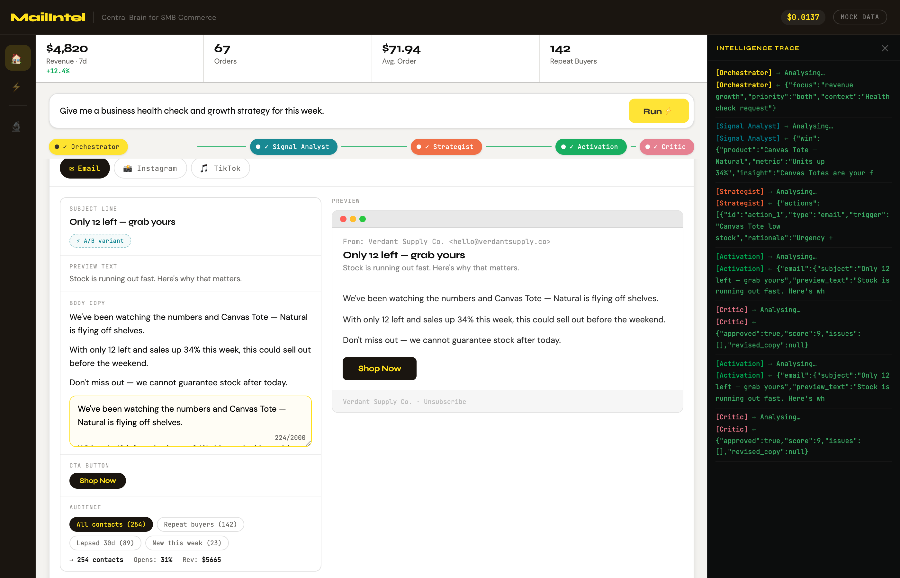
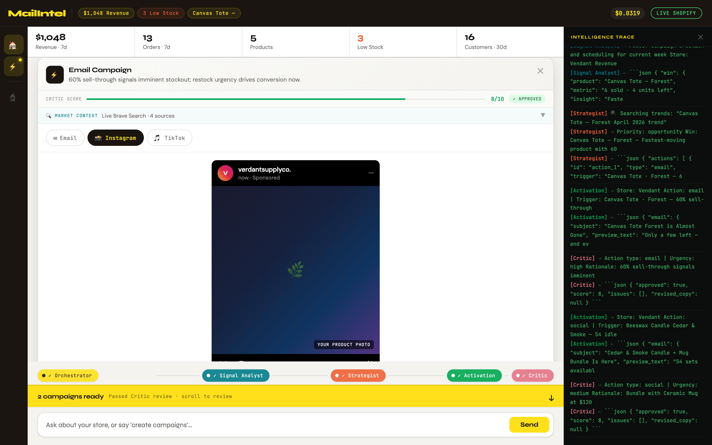
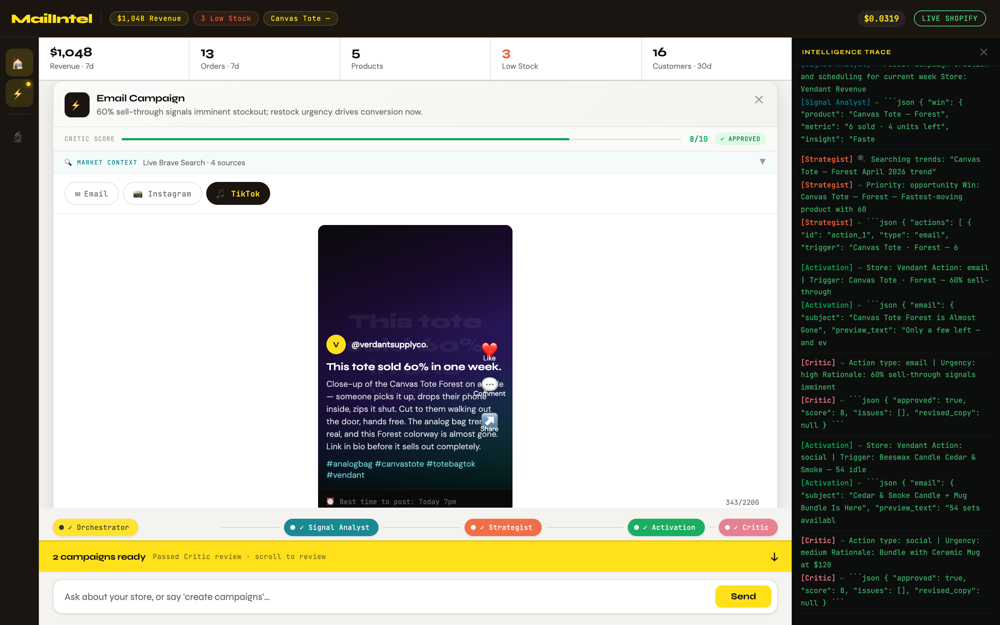
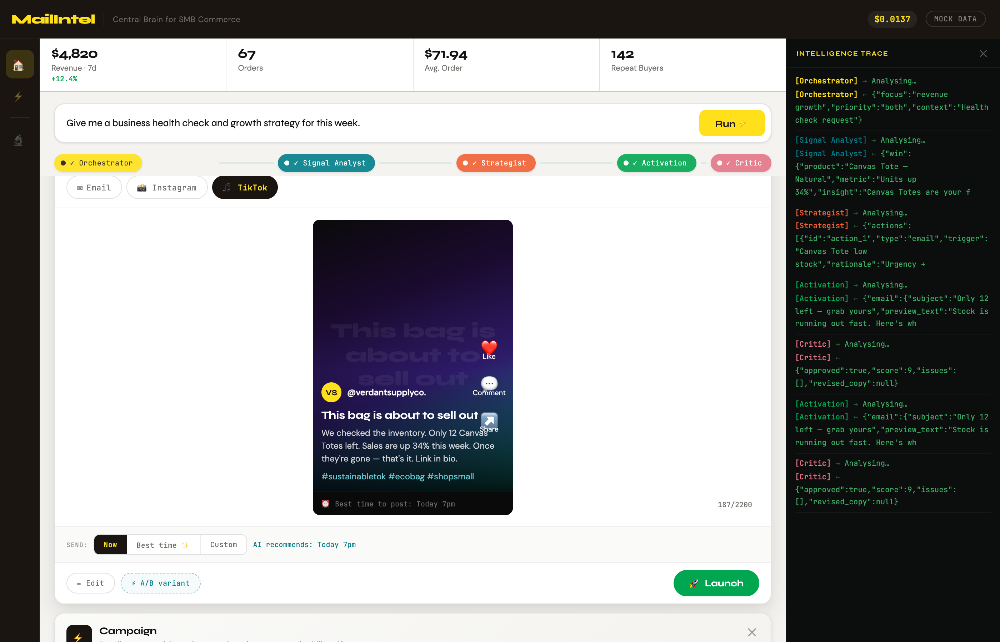
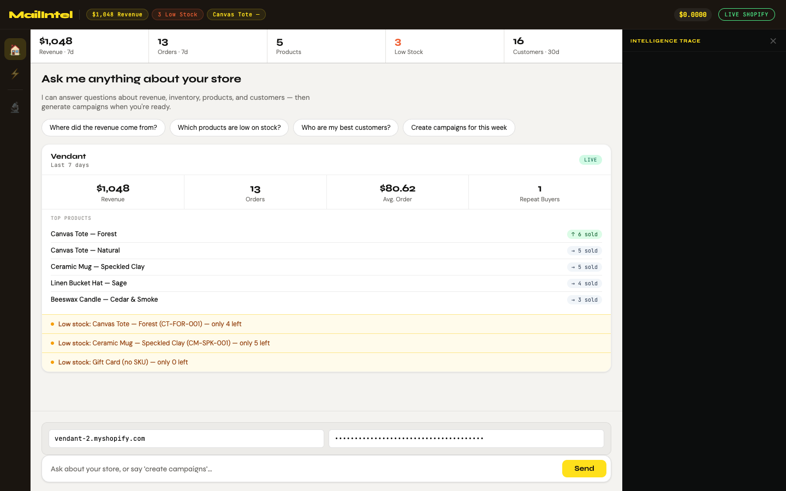

# MailIntel

**`Claude Haiku 4.5 + Sonnet 4.6`** · **`~$0.022/run`** · **`No build tools`** · **`Vanilla HTML/JS`**

SMB owners spend 4+ hours a week switching between dashboards that never tell them what to do next. MailIntel runs 5 AI agents against your Shopify data and returns two ready-to-launch campaigns — across Email, Instagram, and TikTok — in 90 seconds, for $0.022.

---

## The Problem in One Screenshot



Your store data is all there — revenue, orders, product velocity, low-stock alerts — but no dashboard tells you *what to do about it*. MailIntel does.

---

## How It Works

1. **You ask one question** — *"Give me a business health check and growth strategy for this week."*
2. **Five agents run in sequence** — Orchestrator plans → Signal Analyst reads your store data → Strategist pulls live market trends → Activation writes the copy → Critic quality-checks everything before it reaches you
3. **Two campaign cards appear** — Email + Instagram + TikTok copy, grounded in the specific signal that triggered them, with a live Market Context strip showing the Brave Search trends that shaped the copy
4. **You edit, approve, and launch** — one click per platform, on your schedule

---

## The 5 Agents

| Agent | Model | Role | Input → Output |
|-------|-------|------|----------------|
| **Orchestrator** | Haiku 4.5 | Parses your query, sets focus + priority | Query → `{ focus, priority, context }` |
| **Signal Analyst** | Haiku 4.5 | Reads store data, finds one Win + one Opportunity | Store data → `{ win, opportunity, confidence }` |
| **Strategist** | Sonnet 4.6 | Cross-references signals with live web trends, proposes 2 Next Best Actions | Signals + Brave trends → `{ actions[2] }` |
| **Activation** | Sonnet 4.6 | Writes Email + Instagram + TikTok copy in one batch, grounded in trend data | Action + trends → `{ email, instagram, tiktok }` |
| **Critic** | Haiku 4.5 | Sequential 5-step reasoning → scores copy 1–10, rewrites if needed | Draft → `{ approved, score, revised_copy }` |

---

## Screenshots

**Command input + welcome dashboard**



Ask anything — a quick store question gets a Haiku answer in ~1 second. Say "create campaigns" and the full 5-agent loop fires.

---

**Agents running — live trace panel**



Every agent call streams into the Intelligence Trace panel in real time. You see what was sent, what came back, and what it cost.

---

**Results — Signal Analyst + Strategist cards**



The Analyst surfaces what's winning and what's stalling. The Strategist explains why and proposes the two actions worth taking this week — enriched with live Brave Search trend data.

---

**Campaign card — Email (side-by-side editor)**



Left: AI-generated copy (subject, preview text, body, CTA) — always editable, live-synced to the preview. Right: rendered email client preview that updates as you type.

---

**Campaign card — Instagram**



Full Instagram dark-mode post mock with caption, hashtags, and best-time recommendation. A/B variant generates an alternative caption with one click.

---

**Campaign card — TikTok**



Vertical video card (9:16) with hook, script, and hashtags. A/B variant generates an alternative hook line.

---

**Intelligence Trace — every decision visible**



Each log line is colour-coded by agent. `→` shows what was sent. `←` shows what came back. Toggle visibility with the 🔬 icon.

---

**Chat interface — conversational store intelligence**



Ask quick store questions without triggering the full agent pipeline. Haiku answers in ~1 second from cached store data.

---

**Chat with live market trends**


When the question involves trends or market signals, Brave Search fires in parallel and the answer is grounded in live web data.

---

## Key Capabilities

- **Side-by-side email editor** — AI copy on the left, rendered preview on the right, live-synced as you type
- **A/B variant generator** — alternative subject line, caption, or hook via a focused 120-token Claude call (~$0.001)
- **Critic quality score** — every card shows a 1–10 score; copies that score below 8 are auto-revised before reaching you
- **Market Context strip** — collapsible teal strip on every campaign card showing the Brave Search bullets that shaped the copy
- **Audience selector** — target All contacts · Repeat buyers · Lapsed 30d · New this week; contact count and estimated revenue update live
- **Schedule toggle** — Now · Best time ✨ (AI-recommended per platform) · Custom datetime
- **Full Intelligence Trace** — every agent call, every response, every token cost, in real time

---

## Chat Interface

MailIntel includes a full conversational layer that separates quick store questions from campaign generation:

- **Ask anything** — *"Where did the revenue come from?" "Who are my best customers?" "Which products are low on stock?"* — Haiku answers directly from live store data in ~1 second for ~$0.00015
- **Market trend questions** — *"What's trending in eco products?" "What are people buying?"* — Brave Search fires in parallel, answers grounded in live web data
- **Create campaigns** — When you say "create campaigns" or "launch an email", the intent detector routes to the 5-agent pipeline with a confirm step first
- **Campaign CTA** — When a chat answer surfaces an opportunity (low stock, lapsed customers), a "Create campaigns →" button appears inline

Intent detection is keyword-based: `campaign`, `create`, `launch`, `email`, `instagram`, `tiktok`, `generate`, `promote` → agent loop. Everything else → Haiku chat answer.

---

## Live Shopify Integration

MailIntel connects to the Shopify Admin REST API (`2026-01`) through a local CORS proxy built into `dev-server.js`. The browser cannot call the Shopify Admin API directly (CORS), so all requests route through `/shopify-proxy?path=...`.

```bash
# Add Shopify credentials to .env
SHOPIFY_SHOP_URL=https://your-store.myshopify.com
SHOPIFY_ADMIN_API_KEY=shpat_...
```

`dev-server.js` injects both as globals at serve time (`__DEV_SHOPIFY_URL__`, `__DEV_SHOPIFY_TOKEN__`), auto-switches the app to Live mode, and populates the metrics bar + header chips from real data on load.

---

## Brave Search Integration

Every campaign run includes a **live web trend fetch via Brave Search**. One search query is constructed from the winning product + current month, fired in parallel with the Strategist call, and the results are reused across three surfaces — all for a single API call:

```
1 Brave Search call →  Strategist prompt  (shapes the strategy)
                    →  Activation prompt  (makes copy timely and specific)
                    →  Market Context strip on each campaign card
```

The Brave Search results are compressed to bullet form before being passed to agents:

```
• Canvas Tote April 2026 trend ecommerce: Search interest up 28% YoY...
• Eco canvas bags spring 2026: Consumer preference shifting toward...
```

**Zero extra API calls** — the same trend string is cached and threaded through the entire pipeline.

The Brave proxy in `dev-server.js` handles gzip decompression server-side:

```bash
# Add to .env
BRAVE_SEARCH_API_KEY=BSA...
```

---

## MCP Integration

Three MCP servers are registered in `.mcp.json` (gitignored):

| Server | Protocol | What it does |
|--------|----------|--------------|
| `shopify` | Local stdio (`shopify-mcp.js`) | 6 tools: get_shop_info, get_products, get_orders, get_customers, get_inventory, get_sales_summary |
| `brave-search` | npx (`@modelcontextprotocol/server-brave-search`) | Web search for live market trends |
| `sequential-thinking` | npx (`@modelcontextprotocol/server-sequential-thinking`) | Forces step-by-step reasoning in complex evaluations |

### Shopify MCP — 6 Tools

| Tool | What it returns | Token-efficient default |
|------|----------------|------------------------|
| `get_shop_info` | Store name, currency, plan | `fields: "name,currency"` |
| `get_products` | Product list | `limit: 10, fields: "title,variants.inventory"` |
| `get_orders` | Order list | `limit: 10, created_at_min: 7d ago` |
| `get_customers` | Customer list | `limit: 20, fields: "name,orders_count,created_at"` |
| `get_inventory` | Product + variant + stock | `limit: 20, fields: "product,inventory"` |
| `get_sales_summary` | Aggregated revenue + count | Server-side aggregation — no raw order list |

### Sequential Thinking — Critic Quality Gate

The Critic agent uses a **5-step sequential reasoning chain** before producing its final JSON score. This prevents skipping checks and ensures logic is sound before output:

```
STEP 1 — TONE CHECK        Is language warm? Any jargon?
STEP 2 — NAMING VIOLATIONS  "Mailchimp", "based on your data" = auto-fail
STEP 3 — ACCURACY          Does copy match the signal that triggered it?
STEP 4 — CONCIERGE QUALITY  Would a trusted advisor write this?
STEP 5 — FINAL OUTPUT      {"approved": true, "score": 9, ...}
```

The `parseJ()` function handles the mixed reasoning+JSON output: it tries direct parse first, then extracts from the first `{`, then the last `{` — so both pure-JSON agents (Analyst, Strategist) and reasoning-prefix agents (Critic) parse correctly.

---

## MCP Token Optimization

Every MCP tool response carries a **token tax** — the cost of transmitting raw API data through the context window. We eliminated ~90% of this cost through four techniques:

### 1. Aggregated endpoints over raw lists

```
❌ get_orders (limit: 250)  →  ~14,000 tokens (full order objects)
✅ get_sales_summary        →  ~60 tokens    (revenue + count only)

Reduction: 99.6%
```

### 2. Fields filtering on every call

```javascript
// shopify-mcp.js — pick() helper filters before returning
pick(product, ['title', 'variants.inventory_quantity'])

❌ Full product object  →  ~800 tokens each
✅ Filtered (2 fields)  →  ~40 tokens each

Reduction: 95%
```

### 3. Time-scoped queries

```
❌ orders.json (all-time)           →  250+ results, thousands of tokens
✅ orders.json?created_at_min=7d   →  13 results, ~400 tokens
```

### 4. Compressed context for agent calls

Agents receive plain-text summaries, not raw JSON:

```
❌ Full fetchShopify() JSON  →  ~1,200 tokens per agent call
✅ Compressed shopSummary   →  ~150 tokens per agent call

Store: Vendant
Revenue 7d: $1,048 (13 orders, AOV $80.62)
Top products: Canvas Tote Natural [sold:4, inv:8] | Eco Pin Set [sold:2, inv:338]
Alerts: Canvas Tote (CT-NAT-001) — only 8 left
Segments: repeat=0 lapsed=15 new=15
```

### Before / After — Full Run Cost

| Version | Tokens (input) | Cost/run |
|---------|---------------|----------|
| v1 — all Sonnet, raw JSON context | ~28,000 | ~$0.084 |
| v2 — model routing + compressed context | ~8,400 | ~$0.025 |
| v2 + cached store data (no re-fetch) | ~7,200 | ~$0.022 |

**~74% cost reduction** with no change to output quality.

---

## Stack

| Layer | Choice | Why |
|-------|--------|-----|
| Frontend | Vanilla HTML + CSS + JS | Zero setup, deploy anywhere — no build step |
| AI | Claude Sonnet 4.6 + Haiku 4.5 | Sonnet for reasoning, Haiku for routing + critique |
| Commerce data | Shopify Admin REST API `2026-01` | Live orders, products, customers, inventory |
| Market trends | Brave Search API | Real-time web signals for campaign timing |
| Sequential reasoning | `@modelcontextprotocol/server-sequential-thinking` | 5-step Critic chain |
| MCP | Local stdio server (`shopify-mcp.js`) + 2 npx servers | 6 Shopify tools + search + reasoning |
| CORS proxy | `dev-server.js` (`/shopify-proxy`, `/brave-proxy`) | Browser can't call Shopify Admin or Brave directly |
| Fonts | Syne + JetBrains Mono + DM Sans | Display / trace / body hierarchy |
| Dev server | `dev-server.js` (Node built-in `http`) | Reads `.env`, injects keys at serve time |

---

## Getting Started

```bash
git clone https://github.com/bnamatherdhala7/MailIntel.git
cd MailIntel

# Create .env with your keys (never committed — gitignored)
cat > .env <<EOF
ANTHROPIC_API_KEY=sk-ant-...
SHOPIFY_SHOP_URL=https://your-store.myshopify.com
SHOPIFY_ADMIN_API_KEY=shpat_...
BRAVE_SEARCH_API_KEY=BSA...
EOF

# Start dev server — reads .env, injects keys, proxies Shopify + Brave APIs
node dev-server.js
```

Open [http://localhost:3000](http://localhost:3000). API keys are injected into `sessionStorage` at page load and cleared when the tab closes — never written to disk.

**Optional: seed your store with sample data**
```bash
node seed-shopify.js
# Creates 8 products, 12 customers, 13 orders spread over 7 days
```

---

## Cost

| Scenario | Cost |
|----------|------|
| Chat answer (Haiku, store Q&A) | ~$0.00015 |
| Chat answer with Brave Search trend fetch | ~$0.00020 |
| Full run — 5 agents, 2 campaign cards | ~$0.022 |
| 300 full runs/month | ~$6.60/month |
| A/B variant call | ~$0.001 |

*Sonnet 4.6: $3/$15 per M tokens · Haiku 4.5: $1/$5 per M tokens*  
*Token optimization (fields filtering + compressed context + model routing) reduces cost ~74% vs naive implementation.*

---

## Docs

- [`CLAUDE.md`](CLAUDE.md) — Build spec: Workflows, Actions, Tools (the authoritative source)
- [`docs/prd.md`](docs/prd.md) — Full product requirements: problem analysis, architecture decisions, roadmap
- [`agent-prompts.js`](agent-prompts.js) — All 5 system prompts
- [`mock-data.js`](mock-data.js) — Mock Shopify data + audience segments
- [`design-tokens.md`](design-tokens.md) — Colour tokens, typography, component specs

---

## Out of Scope (v1)

- Real email sending (mock success animation only)
- Real Instagram / TikTok posting
- User authentication
- Multi-store support
- Persistent session history

---

*Built for the 33 million small businesses that are drowning in dashboards and starving for decisions.*
