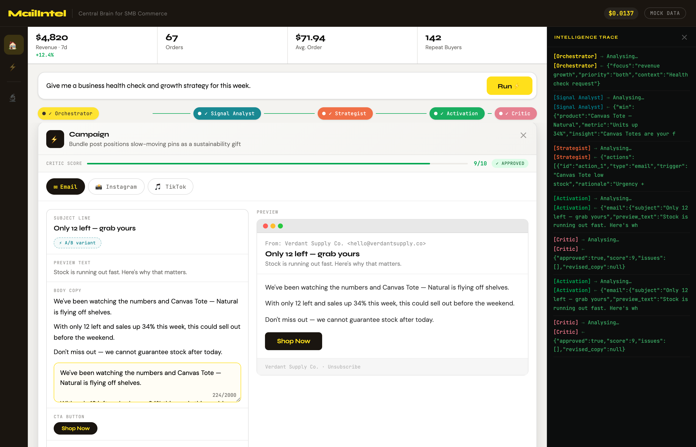

# MailIntel — Central Brain for SMB Commerce

> **5 AI agents. One question. 90 seconds. Ready-to-launch campaigns across Email, Instagram, and TikTok.**

MailIntel transforms fragmented Shopify commerce signals into plain-English intelligence and campaign copy — powered by Claude AI running in a fully visible, auditable loop.

---

## What It Does

Small business owners drown in data but starve for action. MailIntel closes the gap:

1. You ask one question: *"Give me a business health check and growth strategy for this week."*
2. Five AI agents run in sequence — reading your Shopify data, finding the signal, writing the campaigns
3. Two ready-to-approve campaign cards appear: Email + Instagram + TikTok copy, all written and quality-checked
4. You edit, schedule, and launch — one click per platform

**Cost per full run: ~$0.04**

---

## Screenshots

### Welcome Dashboard


The welcome screen shows your live Shopify store data at a glance:
- **Metrics bar** (top): Revenue, Orders, Avg. Order Value, Repeat Buyers — updated from your Shopify store or mock data
- **Store card**: Product velocity table with rising/declining/stable trend badges, low-stock alerts, and upsell opportunities flagged in amber
- **Agent pipeline**: The 5-agent sequence explained with colour-coded chips (Orchestrator → Analyst → Strategist → Activation → Critic)
- **Demo CTA**: One click runs the full intelligence loop with the pre-filled query

---

### Agents Running — Live Progress


When you hit **Run**, the agent stepper activates:
- Each agent pill **pulses** with its theme colour while active
- Connecting lines turn **green** as each agent completes
- The **Intelligence Trace panel** (right) streams every agent call and response in real time — you see the raw JSON, token usage, and reasoning
- The **RUNNING** indicator blinks in the header while the loop is active

---

### Results — Intelligence Cards


After the loop completes, two types of cards appear in sequence:

**Signal Analyst card** — What's happening in your store:
- The Win: what's trending up and why
- The Opportunity: what's lagging and the upsell angle

**Strategist card** — What to do about it:
- Two Next Best Actions, each grounded in a specific commerce signal
- External trend context (seasonal demand, search trends)
- Urgency level: High / Medium

---

### Campaign Card — Email (Side-by-Side)


Each campaign card shows a side-by-side layout:

**Left — AI Copy Panel (always editable):**
- **Subject line** — AI-written, bolded for quick scan
- **⚡ A/B variant** — generates an alternative subject line with one click; "Use this variant" swaps it live
- **Preview text** — the inbox teaser line
- **Body copy** — 3 punchy paragraphs with a live-edit textarea open by default. Edits sync to the preview in real time
- **CTA chip** — the button text
- **Audience selector** — All contacts · Repeat buyers · Lapsed 30d · New this week. Selecting a segment live-updates contact count and estimated revenue

**Right — Rendered Preview:**
- Full email client chrome (macOS traffic light buttons, From/Subject header, body, unsubscribe footer)
- Updates live as you edit the body copy on the left

**Critic Score bar** (below header): A 1–10 quality score from the Critic agent with a colour-coded verdict:
- ✓ APPROVED (green, 8–10)
- ~ REVISED (amber, 6–7) — copy was auto-revised before reaching you
- ✗ FLAGGED (red, 0–5)

---

### Campaign Card — Instagram


Click the **Instagram** platform tab to switch to the social preview:
- Full Instagram dark-mode post mock: avatar, username, product image placeholder, action icons
- Caption and hashtags rendered in the post
- Editable caption textarea with 2,200 character counter
- ⚡ A/B variant generates an alternative caption
- Best time to post recommendation from the AI

---

### Campaign Card — TikTok


Click the **TikTok** tab:
- Vertical video card (9:16 aspect) with gradient background
- Hook displayed large over the video
- Script text overlaid on the lower portion
- Sidebar icons (Like, Comment, Share) — accurate to real TikTok UI
- Hashtags in TikTok blue
- Editable hook/script textarea with ⚡ A/B variant for the hook line

---

### Intelligence Trace Panel


The Trace panel (right side, collapsible) shows every agent interaction in real time:
- Each log line is colour-coded by agent (yellow = Orchestrator, teal = Analyst, orange = Strategist, green = Activation, pink = Critic)
- `→` lines show what was sent to the model
- `←` lines show what came back (truncated to 120 chars)
- Auto-scrolls as new lines stream in
- Toggle visibility with the 🔬 icon in the left nav

---

### Social Campaign Card



The second campaign card covers the social opportunity identified by the Strategist — opening directly on Instagram or TikTok depending on the action type.

---

## The 5 Agents

| Agent | Model | Role | Input → Output |
|-------|-------|------|----------------|
| **Orchestrator** | Haiku 4.5 | Parses your query, sets focus + priority for the Analyst | Query → `{ focus, priority, context }` |
| **Signal Analyst** | Haiku 4.5 | Reads Shopify data, identifies one Win + one Opportunity | Store data → `{ win, opportunity, confidence }` |
| **Strategist** | Sonnet 4.6 | Cross-references signals, proposes 2 Next Best Actions with rationale | Signals → `{ actions[2] }` |
| **Activation** | Sonnet 4.6 | Writes Email + Instagram + TikTok copy for each action | Action → `{ email, instagram, tiktok }` |
| **Critic** | Haiku 4.5 | Scores copy 1–10, approves or rewrites before it reaches you | Draft → `{ approved, score, revised_copy }` |

---

## Key Features

### Side-by-Side Email Editor
The email campaign view splits into AI copy (left) and rendered preview (right). Edit the body textarea and watch the preview update live. No toggle needed — editing is always on.

### A/B Variant Generator
Click **⚡ A/B variant** on any platform tab to generate an alternative subject line, Instagram caption, or TikTok hook via a focused 120-token Claude call. Accept with "Use this variant" to swap it into the live preview.

### Critic Quality Score
Every campaign card shows the Critic agent's score (1–10) with a colour-coded verdict bar. If the Critic found issues, it rewrote the copy before surfacing it — you always see the best version.

### Audience Selector
Email campaigns show four audience segments: All contacts (254) · Repeat buyers (142) · Lapsed 30d (89) · New this week (23). Selecting a segment live-updates the contact count and estimated revenue.

### Schedule Toggle
Each campaign card has a Send row: **Now** · **Best time ✨** (AI-recommended per platform) · **Custom** datetime. Per platform, per card.

### Collapsible Trace Panel
The Intelligence Trace panel can be toggled with the 🔬 icon in the left nav or the ✕ button in the panel header. Collapse it for a cleaner view during review; open it to audit every agent decision.

### Live Cost Counter
Running cost shown in the header, colour-coded: white → yellow → amber → red. A full 5-agent demo run costs ~$0.04.

---

## Stack

| Layer | Choice | Why |
|-------|--------|-----|
| Frontend | Vanilla HTML + CSS + JS | Zero setup, instant demo, deploy anywhere |
| AI | Claude Sonnet 4.6 + Haiku 4.5 | Best reasoning + speed/cost balance |
| Data | Mock Shopify data (or real Shopify Admin API) | Direct commerce signal ingestion |
| Fonts | Syne + JetBrains Mono + DM Sans | Display / monospace / body hierarchy |
| Dev server | Node.js (built-in `http`) | Injects API key from `.env` at serve time |

No framework. No bundler. One HTML file.

---

## Getting Started

```bash
# Clone
git clone https://github.com/bnamatherdhala7/MailIntel.git
cd MailIntel

# Add your Anthropic API key
echo "ANTHROPIC_API_KEY=sk-ant-api03-..." > .env

# Start the dev server (reads key from .env, never writes it to disk)
node dev-server.js

# Open
open http://localhost:3000
```

The dev server injects your API key into the page at serve time via a `<script>` tag. It never writes the key back to any file.

---

## Cost

| Scenario | Cost |
|----------|------|
| Single demo run (5 agents, 2 campaign cards) | ~$0.04 |
| 300 runs/month | ~$12/month |
| A/B variant call | ~$0.001 |

Pricing based on `claude-sonnet-4-6` at $3/$15 per M tokens and `claude-haiku-4-5` at $1/$5 per M tokens.

---

## Docs

- [`CLAUDE.md`](CLAUDE.md) — Build spec: Workflows, Actions, Tools
- [`docs/architecture.md`](docs/architecture.md) — Agent architecture deep dive
- [`docs/product.md`](docs/product.md) — Product vision and market context
- [`agent-prompts.js`](agent-prompts.js) — All 5 system prompts
- [`mock-data.js`](mock-data.js) — Mock Shopify data + audience segments
- [`design-tokens.md`](design-tokens.md) — Colour tokens, typography, component specs
- [`dev-server.js`](dev-server.js) — Local dev server with `.env` key injection

---

## Out of Scope (v1)

- Real email sending (mock success animation only)
- Real Instagram / TikTok posting
- User authentication
- Multi-store support
- Persistent session history

---

*Built for the 33 million small businesses that are drowning in dashboards and starving for decisions.*
